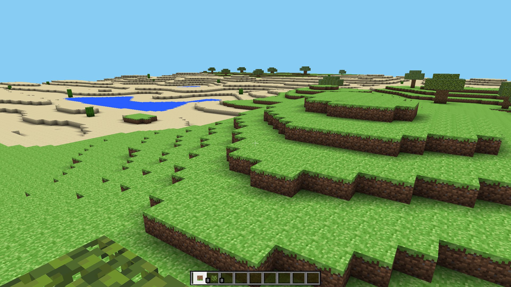

# ⛏️ Python Voxel World Engine (Minecraft Clone)

This project is an ongoing implementation of a Voxel Engine designed to replicate the core mechanics of a block-based sandbox game like Minecraft. It utilizes PyOpenGL and GLFW for the graphics engine and PyRR for mathematical operations. A strong emphasis is placed on using Multithreading and NumPy for optimized performance and chunk generation.

---

## ✨ Features

* **Multithreaded Chunk-Loading:** Block data generation and mesh creation run in separate threads, ensuring smooth, lag-free gameplay.
* **Perlin Noise Terrain:** Realistic, procedurally generated world featuring multiple biomes
* **Voxel-Physic:** Basic collision detection and gravity (jumping, walking, and fall damping) for the player.
* **Culling & Meshing:** Efficient Greedy Meshing is used to drastically reduce the geometry sent to the GPU.
* **Advanced Lighting:** Implementation of a Minecraft-style Light Propagation System (Sunlight & Blocklight) for dynamic illumination and basic soft shading.
* **Interaction:** Placing and destroying blocks using a raycasting system.

---

## 🚀 Installation and Setup

### Prerequisites

Ensure you have the required Python packages installed:

```bash
pip install glfw pyopengl pyrr numpy pynoise Pillow
